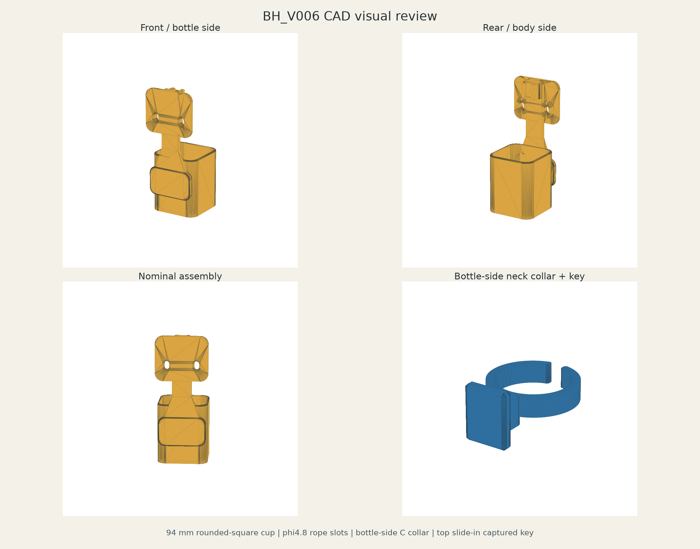

# BH_V006 Waist Bottle Holder

500 mL の丸型・四角型 PET ボトルを腰背面付近で携行するための、PETG 製ボトルホルダーです。V006 は、94 mm 高の rounded-square 下部カップで重量を受け、ボトル透明首部へ常設する C 字カラーのキーを本体 receiver へ上から差し込んで横振れを止めます。ラッチ、ばね、ねじ、接着による日常固定はありません。



## V005 から変更した理由

V005 の円筒カップでは四角型 500 mL ボトルの角が干渉しました。また、大型フォーク、接着ピン、dual glue pin lock bar、M3 高さ調整、毎回操作する TPU ラッチは、部品数と操作を増やします。V006 では、下部を 72 x 72 mm / R11 の rounded-square に変更し、首部はボトル側常設カラーと単純な上差し captured key に置き換えました。

## 採用仕様

### 下部カップ

- 高さ: 94.0 mm
- 機能内包絡: 72.0 x 72.0 mm
- 内側角 R: 11.0 mm
- 壁厚: 3.2 mm
- 底厚: 3.6 mm
- 外形: 78.4 x 78.4 mm / R14.2
- 上端: 外側 R2、内側は最上部 1.2 mm の範囲で片側 1.2 mm 広がるリードイン
- 排水: phi8 mm x 5 穴
- 平らな内壁面に、丸型ボトル用 1--2 mm TPU anti-rattle pad を後付け可能

72 x 72 mm は通常保持部の最大包絡です。入口だけは引っ掛かり防止のため 74.4 x 74.4 mm まで連続的に広がります。カップはボトルを強くクランプせず、底荷重支持と大きな横振れ防止を担当します。

### 背面スパインと身体接触面

- スパイン幅: 30.0 mm
- スパイン厚: 6.5 mm。Authority 6.0 mm に対して PETG 疲労余裕のため +0.5 mm
- 根元角: R6 の rounded plate と左右 50 mm 高の幅広リブ
- 上側接触パッド: 82 x 70 mm / R12 / 厚さ 5 mm
- 下側接触パッド: 74 x 46 mm / R11 / 厚さ 8 mm
- receiver、リブ、スパインは最背面の丸い上側パッドより身体側へ突出しない
- ねじ、ナット、ピンなどの身体側ハードウェアなし
- 上下パッドへ 2.0--2.5 mm TPU comfort pad を任意で貼付可能

35 N の暫定動的荷重に対して、カップ後壁から 30 mm スパインへ細い首を作らず荷重を流す形状です。これは形状上の DFM 判断であり、材料試験や疲労 FEA の完了を意味しません。

### phi4.8 mm 腰紐

- 長円スロット: 8.0 x 14.0 mm x 2
- 中心間隔: 46.0 mm
- 身体側入口: 12 x 18 mm まで二段で広げたトランペット近似
- 身体側開口エッジ: R1.5
- phi4.8 mm 紐に対する最小幅の直径余裕: 3.2 mm

各穴は上側接触パッドと局所ボスを貫通し、単純な phi5 穴より通しやすく、紐の折れと擦れを減らします。

### ボトル側 neck collar

- 名目 ID: 26.0 mm
- 高さ: 7.0 mm
- 壁厚: 3.0 mm
- OD: 32.0 mm
- C 字開口: 5.0 mm
- 開口端: R1.2
- 取付位置: キャップおよび着色リングではなく、その下の透明 PET 首部

カラー背面のキーは 16.0 x 4.0 x 20.0 mm、縦角 R1.2 です。カラーとの根元は幅 10 mm / R3 で、カラー外周からキー後端までの突出は 11.7 mm です。根元上面はカラー上面以下に収め、phi34 mm のキャップ回転包絡を避けています。

### 本体側 top slide-in receiver

- 内幅: 16.8 mm
- 内厚: 4.6 mm
- 名目クリアランス: 幅 0.8 mm、厚み 0.6 mm
- 有効挿入長: 22.0 mm
- ボトル底相対の有効 Z: 176.0--198.0 mm
- 上入口: 1.0 mm chamfer
- 底ストッパー: 全幅 3.0 mm 厚
- 前面 stem slit: 10.8 mm

receiver は後壁、左右レール、前面左右 lip からなる captured-key 構造です。前面中央の 10.8 mm slit はカラー根元だけを通し、16 mm 幅のキー翼は前方へ抜けません。装着・取り外し方向は上面だけです。名目組立ではタブ下端が底ストッパーから 0.5 mm 浮くため、ボトル重量は 3.6 mm 厚のカップ底で受けます。

## 先に印刷する fit coupon

### 1. neck fit

次の順で小型 coupon を印刷し、透明首部へ白化させずに装着でき、手で回り続けない最小の ID を選びます。

1. `BH_V006_neck_fit_coupon_ID26p0_PETG.stl`
2. きつく、強い白化や永久変形が出る場合: `ID26p2`
3. 緩く回る・落ちる場合: `ID25p8`

首部実測値だけで本番を確定せず、同じ PETG、温度、壁数、造形方向で比較してください。選定結果を V006 authority に固定してから本番 collar を出力します。

### 2. slide fit

各 slide coupon STL は receiver と把手付き tab の 2 shell キットです。印刷後に tab を上から挿入して比較します。

1. `S2_nominal`: receiver 16.8 x 4.6 mm。最初に試す候補
2. `S1_tight`: receiver 16.5 x 4.4 mm。S2 に実用上大きなガタがある場合
3. `S3_loose`: receiver 17.1 x 4.8 mm。S2 が固い、鳴く、片手で抜けない場合

PASS は、重力で奥まで入るか軽い指圧で入り、上下操作で噛み込まず、左右回転ガタが実用範囲であることです。寸法の採用は必ず実印刷結果で決めます。

## 取付と操作

1. 選定済み neck collar の C 字開口を透明 PET 首部へ横からゆっくりスナップします。キャップと着色リングには掛けません。
2. カラーはボトルへ着けたまま使用します。飲み口およびキャップ開閉に干渉しない高さを確認します。
3. ボトル底を 94 mm カップへ入れながら、背面キーを receiver 上面へ合わせます。
4. ボトルを下へ降ろし、底面をカップ底へ完全に着座させます。キーを底へ押し付けて重量を吊らないでください。
5. 取り外しはボトルを意図して真上へ持ち上げるだけです。

本構造は重力保持です。転倒、逆さ、ジャンプ、激しい転落では上方へ抜けて脱落する可能性があります。安全確保が必要な用途では別系統のストラップが必要です。

## 印刷推奨条件

### Main body

- Bambu Lab A1 / 0.4 mm nozzle
- PETG Basic 相当
- カップ底を build plate へ置く垂直姿勢
- 0.20 mm layer
- 5 walls
- top/bottom 5--6 layers
- 30--40% infill。gyroid または cubic を推奨
- receiver 底とパッド下面の短いブリッジは 11 mm 未満。まず support なしで bridge preview を確認
- elephant foot compensation を有効化し、底の 3.6 mm 支持面と排水穴を潰さない

### Collar / coupons

- 0.16--0.20 mm layer
- 4--5 walls
- neck fit coupon はリング軸を Z とし、同一条件で 3 種比較
- 本番 collar は tab 下端を build plate 側にして 5--8 mm brim を推奨。リング下面だけ最小限の snug/tree support を許容
- slide coupon は提供 STL の姿勢で receiver と tab を同時印刷し、brim は部品間を連結しない設定にする

PETG は腰作業時の衝撃に対して PLA より靭性と耐熱余裕があり、薄い C 字カラーでも脆性破壊しにくいため採用しています。ただし過大に開くと白化・永久変形するため coupon 選定が必須です。

TPU comfort pad と丸型ボトル用 anti-rattle pad は optional であり、本 lane には STL を含めていません。パッドなしでも挿入・使用可能な寸法です。

## 自動 validation

`validation_report.json` の結果は CAD 項目 `PASS`、物理項目 6 件 `PENDING` です。

- 全 9 STEP の生成・再読込: PASS
- 全 9 STL の watertight: PASS
- non-manifold edge = 0: PASS
- negative volume なし: PASS
- duplicate body なし: PASS。slide coupon の 2 shell は相互に異なる意図した部品
- main body / neck collar 名目交差: 0.000000 mm3
- 上方 +30 mm から着座までの Z 挿入経路: 衝突 0
- receiver 閉底ストッパー: PASS
- nominal neck ID 26.0 mm gauge: PASS
- cup 高さ 94.0 mm、機能内包絡 72 x 72 mm: PASS
- rope slot 2 箇所 / phi4.8 gauge: PASS
- phi34 mm cap rotation envelope: PASS
- 名目 tab / bottom stop gap 0.5 mm: PASS

詳細な数値、各 STL の三角形数、体積、bounds は `validation_report.json` を参照してください。CAD validation は物理 fit、疲労寿命、人体快適性、バウンドを保証しません。

## Field test criteria

次をすべて実施し、観察結果と使用ボトル型番を記録します。

1. 500 mL 満水ボトルを挿入する。
2. 通常立位で自然脱落しない。
3. 徒歩 100 歩で自然脱落しない。
4. 深い屈伸 10 回を行う。
5. しゃがむ、立つを 10 回行う。
6. 腰を左右へ 10 回ひねる。
7. 上体前屈を 10 回行う。
8. neck collar が receiver から自然に浮き上がらない。
9. 四角型ボトルで角の強い擦れ、食い込みがない。
10. 丸型ボトルで実用上許容できない大きなガタがない。
11. phi4.8 mm 紐穴周辺に白化、割れがない。
12. 身体側に痛い角、局所圧迫がない。
13. 意図してボトルを上へ持ち上げれば片手で取り外せる。

## PENDING

- `NECK_COLLAR_PHYSICAL_FIT = PENDING`
- `SLIDE_PHYSICAL_FIT = PENDING`
- `ROUND_BOTTLE_FIELD_FIT = PENDING`
- `SQUARE_BOTTLE_FIELD_FIT = PENDING`
- `BODY_COMFORT_FIELD_TEST = PENDING`
- `BOUNCE_FIELD_TEST = PENDING`
- 35 N 繰返し荷重の実機疲労試験または FEA は未実施

## 再生成

リポジトリ root から実行します。

```powershell
conda run -n paddy-cadquery-280-py312 python cad/accessories/waist_bottle_holder/v006/source/build_bh_v006.py
conda run -n paddy-cadquery-280-py312 python cad/accessories/waist_bottle_holder/v006/source/render_bh_v006_preview.py
```

生成スクリプトは V006 lane 内だけを書き換えます。Git branch / HEAD を変更する処理、`git add`、`git commit` は含みません。

## 成果物

### STEP

- `step/BH_V006_main_body_94mm_squircle_rope4p8_PETG.step`
- `step/BH_V006_neck_collar_slide_tab_ID26p0_PETG.step`
- `step/BH_V006_neck_fit_coupon_ID25p8_PETG.step`
- `step/BH_V006_neck_fit_coupon_ID26p0_PETG.step`
- `step/BH_V006_neck_fit_coupon_ID26p2_PETG.step`
- `step/BH_V006_slide_fit_coupon_S1_tight_PETG.step`
- `step/BH_V006_slide_fit_coupon_S2_nominal_PETG.step`
- `step/BH_V006_slide_fit_coupon_S3_loose_PETG.step`
- `step/BH_V006_assembly_reference.step`

### STL

- `stl/BH_V006_main_body_94mm_squircle_rope4p8_PETG.stl`
- `stl/BH_V006_neck_collar_slide_tab_ID26p0_PETG.stl`
- `stl/BH_V006_neck_fit_coupon_ID25p8_PETG.stl`
- `stl/BH_V006_neck_fit_coupon_ID26p0_PETG.stl`
- `stl/BH_V006_neck_fit_coupon_ID26p2_PETG.stl`
- `stl/BH_V006_slide_fit_coupon_S1_tight_PETG.stl`
- `stl/BH_V006_slide_fit_coupon_S2_nominal_PETG.stl`
- `stl/BH_V006_slide_fit_coupon_S3_loose_PETG.stl`
- `stl/BH_V006_assembly_preview.stl`

### Source / parameters / validation / docs

- `source/build_bh_v006.py`
- `source/render_bh_v006_preview.py`
- `parameters.json`
- `parameters/README.md`
- `validation_report.json`
- `validation/artifact_manifest.json`
- `validation/README.md`
- `docs/BH_V006_visual_review.png`
