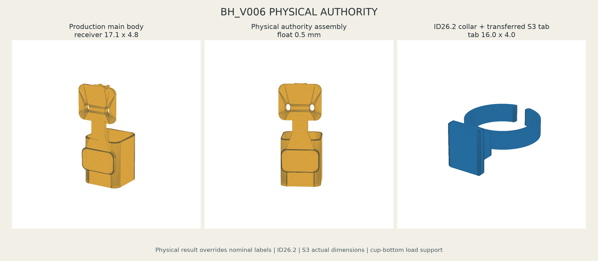

# BH_V006 Physical Authority Production

PETGで印刷したV006 fit couponの物理試験結果を最優先Authorityとして反映したproduction CADです。既存coupon、既存`parameters.json`、既存nominal成果物は削除・変更していません。



## 確定Authority

### Neck collar

- 3候補: ID25.8 / ID26.0 / ID26.2
- 採用: **ID26.2**
- Physical state: `NECK_COLLAR_PHYSICAL_FIT = PASS`
- Production ID: 26.2 mm
- 高さ: 7.0 mm
- 壁厚: 3.0 mm
- C字開口: 5.0 mm
- 開口端R: 1.2 mm

ID26.2は実ボトル透明首部へ適合し、必要な保持を得ながら意図した取り外しが容易で、常設用途に適し、過度な締付けを避けられたため採用しました。physical-tested couponのC字開口、端部R、スナップ形状をそのまま使用しています。ID26.0をproduction authorityには使用していません。

### Slide

`S1/S2/S3`の名称から推測せず、既存`parameters.json`の全実寸を比較しました。

| Candidate | Tab W x T | Receiver internal W x T |
|---|---:|---:|
| S1_tight | 16.0 x 4.0 mm | 16.5 x 4.4 mm |
| S2_nominal | 16.0 x 4.0 mm | 16.8 x 4.6 mm |
| **S3_loose** | **16.0 x 4.0 mm** | **17.1 x 4.8 mm** |

3候補のtabはすべて同寸で、receiverが最大・最厚の組はS3でした。したがって次をproduction authorityとします。

- `BH_V006_SLIDE_AUTHORITY = S3_loose`
- Authority semantic: `PHYSICAL_LARGEST_THICKEST_PAIR`
- `SLIDE_TAB_AUTHORITY_WIDTH = 16.0 mm`
- `SLIDE_TAB_AUTHORITY_THICKNESS = 4.0 mm`
- `SLIDE_RECEIVER_AUTHORITY_WIDTH = 17.1 mm`
- `SLIDE_RECEIVER_AUTHORITY_THICKNESS = 4.8 mm`
- 実クリアランス: 幅1.1 mm、厚み0.8 mm
- 挿入長: 22.0 mm
- 前面stem slit: 10.8 mm
- 入口chamfer: 1.0 mm

名称上の`loose`より、物理試験で手動挿入・取り外しが容易、引っ掛かりなし、実用品として滑らかだった結果を優先しました。追加の安全クリアランスは加えていません。

production tabはnominal collar用tabを流用せず、S3 coupon generatorが作ったtab B-repをそのまま位置移動してID26.2 collarへ結合しました。CAD比較でcoupon tabとproduction tabの体積差および対称差はともに0 mm3です。

### 摩擦保持の扱い

- `SLIDE_INSERTION_BY_HAND = PASS`
- `SLIDE_REMOVAL_BY_HAND = PASS`
- `SLIDE_PHYSICAL_FIT = PASS`
- `SLIDE_FRICTION_RETENTION = PASS_CANDIDATE`

物理報告は「適度な摩擦保持も期待できる」「通常姿勢で自然に抜ける懸念は小さい」という評価です。歩行・屈伸を含むfield retention完了の記載ではないため、摩擦保持だけは過大に確定せず`PASS_CANDIDATE`としました。

## 維持したmain body Authority

- Cup高さ: 94.0 mm
- 機能内包絡: 72.0 x 72.0 mm / R11
- 壁厚: 3.2 mm
- 底厚: 3.6 mm
- 排水: phi8 mm x 5
- Rope slot: 8 x 14 mm x 2
- Rope slot中心間: 46 mm
- 対応紐: phi4.8 mm
- rounded-square cup、身体側丸み、上下接触パッド、30 mm背面スパイン、左右補強リブを維持

receiver内部だけを17.1 x 4.8 mmへ更新しました。外周側の変更はその寸法転写に必要な範囲だけです。

## 荷重経路とfloat

主重量経路は次のままです。

`BOTTLE -> 94mm CUP -> BOTTOM -> MAIN BODY / SPINE -> ROPE SUPPORT`

neck collar / tab / receiverは上部位置決め、左右・前後の振れ止め、軽い摩擦保持だけを担当します。ボトル重量を首スライドで吊りません。

- Bottle support plane: Z=3.6 mmのcup floor
- Receiver cavity bottom: bottle bottom相対Z=176.0 mm
- Assembly実測float: **0.500 mm**
- Target: 0.5 mm
- 許容目標: 0.3--0.8 mm

floatは正で許容範囲内です。tabはreceiver底ストッパーへ接触せず、cup bottomが主重量支持点です。

## CAD validation結果

`validation_report_physical_authority.json`の集計:

- `PASS = 30`
- `FAIL = 0`
- `PASS_CANDIDATE = 1`
- `PENDING = 5`
- Overall CAD status: `PASS`

主要結果:

- Production STEP 3個生成・再読込成功
- Production STL 3個すべてwatertight
- non-manifold edge = 0
- negative volumeなし
- duplicate solidなし
- main body / collar名目交差 = 0.000000 mm3
- Z +30 mmから着座までの直線挿入経路干渉 = 0
- receiver closed bottom stop = PASS
- production collar ID26.2 = PASS
- production tab 16.0 x 4.0 mm = PASS
- production receiver実測17.1 x 4.8 mm = PASS
- S3 coupon tab / production tab solid差 = 0 mm3
- 94 mm cup、72 x 72 / R11、phi8 drain x5を維持
- rope slot 8 x 14 x2 / 46 mm centersを維持
- phi34 mm cap rotation envelope干渉 = 0
- assembly float = 0.500 mm

## 次に印刷する2ファイル

1. `stl/BH_V006_neck_collar_slide_tab_ID26p2_AUTHORITY_PETG.stl`
2. `stl/BH_V006_main_body_PHYSICAL_AUTHORITY_PETG.stl`

まずproduction collarのID26.2 fitと、S3 coupon由来tab形状が実物receiver条件に一致することを確認します。その後main bodyを印刷してください。全couponの再印刷は不要です。

推奨条件は従来V006と同じです。

- Bambu Lab A1 / 0.4 mm nozzle
- PETG Basic相当
- Main: 0.20 mm、5 walls、top/bottom 5--6、30--40% infill、cup bottomをbuild plateへ
- Collar: 0.16--0.20 mm、4--5 walls、tab下端側、5--8 mm brim、必要ならring下面だけ最小support

## 残るFIELD PENDING

- `ROUND_BOTTLE_FIELD_FIT = PENDING`
- `SQUARE_BOTTLE_FIELD_FIT = PENDING`
- `BODY_COMFORT_FIELD_TEST = PENDING`
- `BOUNCE_FIELD_TEST = PENDING`
- `35N_CYCLIC_DURABILITY = PENDING`

特に四角型ボトルは旧円筒cupで角干渉した履歴があるため、新72 x 72 / R11 main bodyでの実物fitまでPASSにしません。歩行100歩、深い屈伸、しゃがみ、腰ひねり、前屈、自然浮上、身体局所圧迫、紐穴白化を従来READMEのfield criteriaで確認してください。

## Git記録

Generation snapshot:

- START branch: `agent/organize-untracked-cad-assets-20260725`
- START HEAD: `7c149a65053f2292bc4cc0ed06d8941c96852f2b`
- END branch: `agent/organize-untracked-cad-assets-20260725`
- END HEAD: `7c149a65053f2292bc4cc0ed06d8941c96852f2b`
- branch / HEAD unchanged: PASS
- 既存tracked status snapshot unchanged: PASS

この作業ではGit変更操作を実行していません。開始時から存在したtracked変更4件には触れていません。

## 成果物

### STEP

- `step/BH_V006_main_body_PHYSICAL_AUTHORITY_PETG.step`
- `step/BH_V006_neck_collar_slide_tab_ID26p2_AUTHORITY_PETG.step`
- `step/BH_V006_assembly_PHYSICAL_AUTHORITY.step`

### STL

- `stl/BH_V006_main_body_PHYSICAL_AUTHORITY_PETG.stl`
- `stl/BH_V006_neck_collar_slide_tab_ID26p2_AUTHORITY_PETG.stl`
- `stl/BH_V006_assembly_PHYSICAL_AUTHORITY_preview.stl`

### Source / parameters / validation / docs

- `physical_authority.json`
- `source/build_bh_v006_physical_authority.py`
- `source/render_bh_v006_physical_authority.py`
- `validation_report_physical_authority.json`
- `validation/artifact_manifest_physical_authority.json`
- `validation/README.md`
- `docs/BH_V006_PHYSICAL_AUTHORITY_visual_review.png`

## 再生成

Repository rootから実行します。

```powershell
conda run -n paddy-cadquery-280-py312 python cad/accessories/waist_bottle_holder/v006/authority/source/build_bh_v006_physical_authority.py
conda run -n paddy-cadquery-280-py312 python cad/accessories/waist_bottle_holder/v006/authority/source/render_bh_v006_physical_authority.py
```

生成sourceはGitコマンドをbranch / HEAD / tracked statusの読取りにだけ使用し、Git変更操作を含みません。
