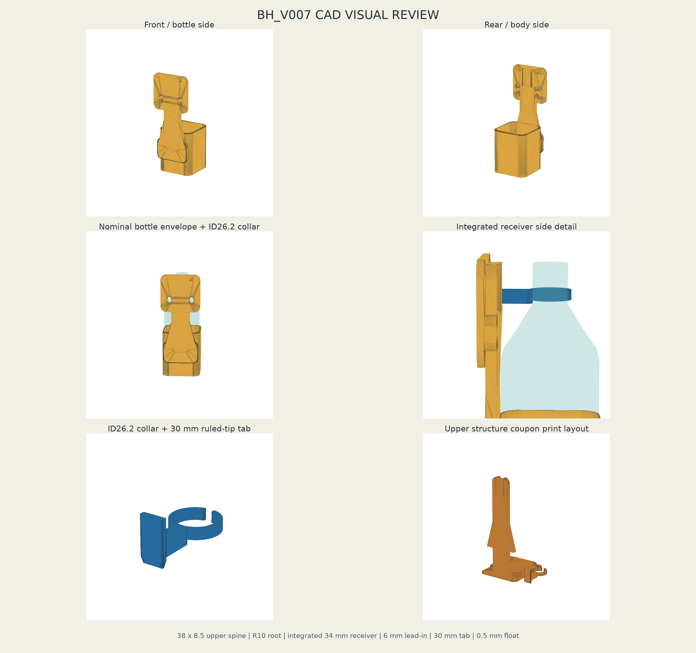

# BH_V007 Reinforced Upper Spine + Integrated Long Slide Receiver

V006 full bodyで確認された「上部破損」「full bodyでのslide-in困難」「前方receiver台座によるボトル傾き」を同時に解消するため、94 mm lower cupを維持し、上部構造を全面再設計したV007です。



## V006 Physical Authorityから継承した固定値

- Neck collar: ID26.2
- Slide fit: S3 physical authority
- Tab hold section: 16.0 x 4.0 mm
- Receiver hold section: 17.1 x 4.8 mm
- Clearance: 幅1.1 mm、厚み0.8 mm
- Cup: 高さ94.0 mm、72 x 72 mm / R11、壁3.2 mm、底3.6 mm
- Drain: phi8 mm x 5
- Rope slot: 8 x 14 mm x2、中心間46 mm、phi4.8 mm紐

これらの物理Authorityは変更していません。V007で変更したのはtab長、receiver長、入口guide、upper spine断面、rib、root fillet、receiver integration、局所bottle clearanceです。

## 3問題への設計回答

### 1. 上部破損

V006の30 x 6.5 mm spineを、V007では38 x 8.5 mmの連続断面へ変更しました。カップ後壁からreceiverまで細い首を作らず、一体のrounded spineでつなぎます。

- Upper spine: 38.0 x 8.5 mm
- Root fillet: R10
- Receiver-to-spine rib: 4.5 mm厚 x2
- Cup-root lateral wing: spine全厚8.5 mm x2
- 解析上の連続spine断面: 195 -> 323 mm2、+65.64%
- CAD形状自体で断面を確保し、低infillだけへ依存しない

強度向上は断面比較と形状連続性に基づくCAD対策です。実疲労強度や35 N cyclic durabilityはphysical test完了までPENDINGです。

### 2. Full bodyでslide-inしにくい

- Tab全長: 20 -> 30 mm
- Receiver全案内長: 22 -> 34 mm
- Hold section: 17.1 x 4.8 mm / 28 mm長
- Entry guide: 上端6 mm
- Entry最大: 17.5 x 5.1 mm
- Entryからhold部へ段差のないloft taper
- Tab先端4 mm: 14 x 2 mmから16 x 4 mmへ直線ruled taper
- 上面は完全開放。spine capや横向き入口なし

物理fit済みの17.1 x 4.8 mm保持寸法は広げていません。大きくしたのは入口だけです。

### 3. 前方台座でボトルが傾く

V006の別体的な前方receiver台座を廃止し、channelをrear spineへ直接切った一体構造としました。

- V006 receiver前方突出: 18.90 mm
- V007 receiver前方突出: 2.85 mm
- 削減: 84.92%
- Receiver/spine CAD fused overlap: 7324.896 mm3
- Cup/bottle centerline offset: 0.000 mm
- Receiver/tab lateral X offset: 0.000 mm
- 保守的な72 mm rounded-square upper body / shoulder / phi26.2 neck envelopeとのupper structure交差: 0 mm3

receiverはspineと直接重なって融合しており、前方へ載せる台座部品はありません。

## 主要寸法

### Main body

- Cup height: 94.0 mm
- Functional cavity: 72 x 72 mm / R11
- Cup wall / bottom: 3.2 / 3.6 mm
- Upper spine width / thickness: 38.0 / 8.5 mm
- Spine Z: 54.0--213.6 mm
- Root fillet: R10
- Upper rounded body pad: 82 x 78 mm / R12 / 5 mm厚
- Lower rounded body pad: 74 x 46 mm / R11 / 8 mm厚
- Main maximum Z: 218.6 mm。Bambu Lab A1の256 mm内

### Integrated receiver

- Center Y: -41.9 mm
- Hold gauge: 17.1 x 4.8 mm
- Hold length: 28.0 mm
- Entry gauge: 17.5 x 5.1 mm
- Entry guide length: 6.0 mm
- Total guide length: 34.0 mm
- Front stem slit: 10.8 mm
- Closed bottom stop: 3.0 mm
- Cavity Z: 179.6--213.6 mm

### ID26.2 long-tab collar

- Collar ID / height / wall: 26.2 / 7.0 / 3.0 mm
- C opening / tip radius: 5.0 mm / R1.2
- Tab hold gauge: 16.0 x 4.0 mm
- Tab length: 30.0 mm
- Tab root plan radius: R4
- Nose lead-in: 4.0 mm
- Rearward reach: 27.8 mm。receiverをrear spineへ埋め込むための値
- Root上面はcollar上面以下で、phi34 mm cap envelopeとの交差なし

## Load pathとassembly float

主重量経路は次のままです。

`BOTTLE -> CUP BOTTOM -> MAIN BODY -> SPINE / ROPE SUPPORT`

neck collar / tab / receiverは上部位置決め、前後・左右の振れ止め、軽い摩擦保持のみを担当します。

- Bottle support plane: cup floor Z=3.6 mm
- Tab bottom at nominal assembly: Z=180.1 mm
- Receiver stop-facing cavity bottom: Z=179.6 mm
- Assembly float: **0.500 mm**
- Target range: 0.3--0.8 mm

tabはbottom stopへ荷重を掛けず、cup floorがボトル重量を支持します。

## 最初に印刷するもの

**Full main bodyの前に、次を印刷してください。**

`stl/BH_V007_upper_structure_coupon_PETG.stl`

このSTLは2 shellのprint kitです。

1. 実物と同じ38 x 8.5 spine、R10 root断面、左右rib、integrated receiver、6 mm entry、bottom stopを持つ実高さfixture
2. ID26.2 long-tab collar

fixture底面は3.6 mmの実bottle support planeで、8 mm高の浅い72 x 72 / R11 datum rimを持ちます。full 94 mm cupを印刷せず、実ボトルを立ててreceiver突出、肩干渉、centerline、上部撓みを確認できます。coupon内のactual upper structure欠落量はCAD比較で0 mm3です。

Long-tab collarはfixture横へ別置きしたprint shellです。印刷後に取り外して実ボトルへ装着してください。

## Phase 1: upper structure coupon test

1. ID26.2 neck collarを実ボトル透明首部へ装着する。
2. Bottle底をcouponの3.6 mm support面、72 x 72 datum内へ置く。
3. Long tabをreceiver上面からslide-inする。
4. 30回挿抜する。
5. Collar、tab、receiverに白化がない。
6. 欠け、亀裂がない。
7. 大きな摩耗や粉がない。
8. 片手で着脱できる。
9. 斜め噛みしない。
10. ボトルが自然に垂直へ入る。
11. Receiver/spineが肩部へ接触しない。
12. ボトルを手で前後に揺すっても上部構造が大きく撓まず、rib/rootに白化がない。

Phase 1 PASS後にfull main bodyを印刷します。

## Phase 2: full main body test

1. 丸型500 mL fit
2. 四角型500 mL fit
3. 500 mL満水
4. 歩行100歩
5. 深い屈伸10回
6. しゃがみから立位10回
7. 前屈10回
8. 左右ひねり10回
9. Upper spine亀裂なし
10. Receiver根元白化なし
11. Neck slide自然脱落なし
12. 身体への鋭い当たり、局所圧迫なし

## 印刷推奨

### Upper structure coupon

- Bambu Lab A1 / 0.4 mm nozzle / PETG Basic相当
- 0.20 mm layer
- Upper spine/receiver周辺6 walls推奨
- 5--6 top/bottom layers
- 30--40% gyroidまたはcubic infill
- Fixture baseをbuild plateへ
- Long collar shellはtab先端側へ5--8 mm brim
- Ring下面だけ必要最小限のsnug/tree support
- Fixture高さ213.6 mm、A1 Z envelope内

### Full main body

- Cup bottomをbuild plateへ置く垂直姿勢
- 0.20 mm layer
- Main全体5 walls以上、upper spine/receiverはmodifierで6 walls推奨
- 30--40% infill
- Receiver上面は開放され、旧式の大きな前方floor bridgeはない
- Slicer previewでchannel、bottom stop、front stem slitが潰れていないことを確認

Infillを増やすだけで破損対策とせず、6 wallsはCAD断面強化への追加余裕として扱います。

## CAD validation

`validation_report.json`集計:

- `PASS = 40`
- `FAIL = 0`
- `PENDING = 8`
- Overall CAD status: `PASS`

確認済み:

- STEP 4個生成・再読込成功
- STL 4個すべてwatertight
- non-manifold edge = 0
- negative volumeなし
- duplicate solidなし
- Cup 94 mm / 72 x 72 / R11維持
- Rope slots 8 x 14 x2 / 46 mm centers維持
- Neck ID26.2維持
- Tab 16 x 4 x 30 mm
- Receiver hold 17.1 x 4.8 mm / 全長34 mm
- 6 mm entry loft存在
- +42 mmから着座までstraight slide path intersection = 0 mm3
- Nominal main/collar intersection = 0 mm3
- Bottle shoulder envelope intersection = 0 mm3
- Receiver前方突出84.92%削減
- Spine 38 x 8.5 / R10 / rib x2
- Assembly float 0.500 mm
- Couponへactual upper structureを完全転写

CAD validationは上部強度、長いslideの物理fit、身体快適性を物理PASSにしません。

## V006 / V007比較

| Item | V006 Physical Authority | V007 | Change |
|---|---:|---:|---:|
| Receiver forward protrusion | 18.90 mm | 2.85 mm | -84.92% |
| Upper spine section | 195 mm2 | 323 mm2 | +65.64% |
| Root fillet | R6 | R10 | +4 mm |
| Receiver guide | 22 mm | 34 mm | +12 mm |
| Tab length | 20 mm | 30 mm | +10 mm |
| Bottle centerline offset | - | 0.000 mm | aligned |
| Main CAD volume | 193032.32 mm3 | 205780.21 mm3 | +6.60% |
| Solid PETG equivalent mass* | 245.15 g | 261.34 g | +16.19 g |

* 密度1.27 g/cm3でCAD solid全体を換算した比較値です。実印刷質量はwallsとinfillで小さくなります。

詳細は`docs/V006_V007_GEOMETRY_COMPARISON.md`と`validation_report.json`を参照してください。

## Physical state

V006から継承済み:

- `NECK_ID26p2_PHYSICAL_FIT = PASS`
- `V006_SLIDE_S3_PHYSICAL_FIT = PASS`

V007で再試験するためPENDING:

- `V007_LONG_SLIDE_PHYSICAL_FIT`
- `V007_VERTICAL_BOTTLE_ALIGNMENT`
- `V007_UPPER_STRUCTURE_STRENGTH`
- `V007_ROUND_BOTTLE_FIELD_FIT`
- `V007_SQUARE_BOTTLE_FIELD_FIT`
- `V007_BODY_COMFORT`
- `V007_BOUNCE_TEST`
- `V007_35N_CYCLIC_DURABILITY`

## 再生成

Repository rootから実行します。

```powershell
conda run -n paddy-cadquery-280-py312 python cad/accessories/waist_bottle_holder/v007/source/build_bh_v007.py
conda run -n paddy-cadquery-280-py312 python cad/accessories/waist_bottle_holder/v007/source/render_bh_v007_preview.py
```

V006はread-only geometry referenceです。生成sourceはV007 lane内だけを書き、Git変更操作を含みません。

## 成果物

### STEP

- `step/BH_V007_main_body_reinforced_integrated_slide_PETG.step`
- `step/BH_V007_neck_collar_ID26p2_long_tab_PETG.step`
- `step/BH_V007_upper_structure_coupon_PETG.step`
- `step/BH_V007_assembly_reference.step`

### STL

- `stl/BH_V007_main_body_reinforced_integrated_slide_PETG.stl`
- `stl/BH_V007_neck_collar_ID26p2_long_tab_PETG.stl`
- `stl/BH_V007_upper_structure_coupon_PETG.stl`
- `stl/BH_V007_assembly_preview.stl`

### Source / parameters / validation / docs

- `source/build_bh_v007.py`
- `source/render_bh_v007_preview.py`
- `parameters.json`
- `parameters/README.md`
- `validation_report.json`
- `validation/artifact_manifest.json`
- `validation/README.md`
- `docs/BH_V007_visual_review.png`
- `docs/V006_V007_GEOMETRY_COMPARISON.md`
