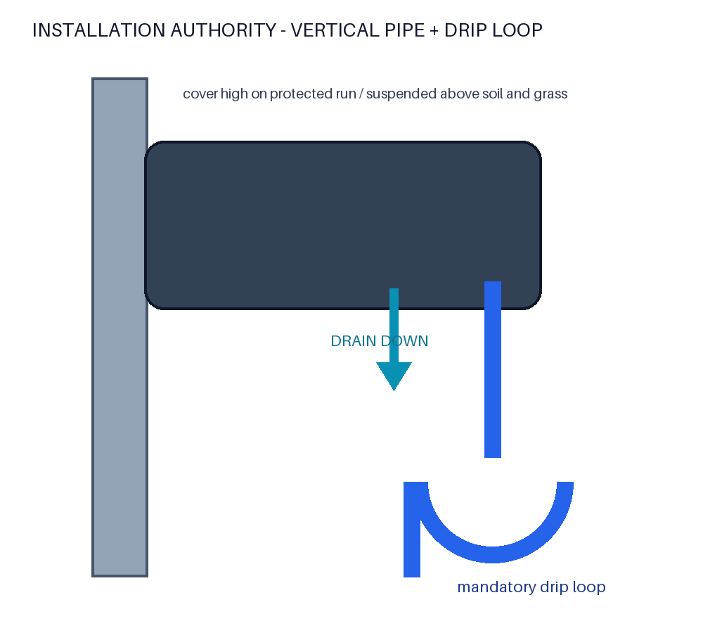

# INSTALLATION AUTHORITY

The installation orientation is part of the water-management design and is mandatory.

```text
INSTALLATION_REQUIRED:
vertical support pipe

raincover:
mounted near upper portion of protected cable run

cover long axis:
approximately horizontal

drain:
DOWNWARD

cable port:
NOT UPWARD

cable:
DRIP LOOP REQUIRED BELOW COVER

cover:
suspended above ground
```

## Procedure

1. Mount to a vertical support pipe at a high, protected location.
2. Keep the long axis approximately horizontal and both drain outlets facing down.
3. Do not orient either cable port upward.
4. Route each cable downward after leaving the cover and form a clear low point below the cover.
5. Suspend the cover above soil, grass, mud, standing water, and splash accumulation.
6. Inspect and clean the Ø2.5 mm drains periodically; check especially for mud, grass, insects, and debris.

The drip loop reduces cable-tracked water volume before it reaches the entrance. It does not stop a pressure jet directed into the port. Pressure washers, high-pressure hoses, forced continuous jets, and immersion are prohibited operating conditions.



