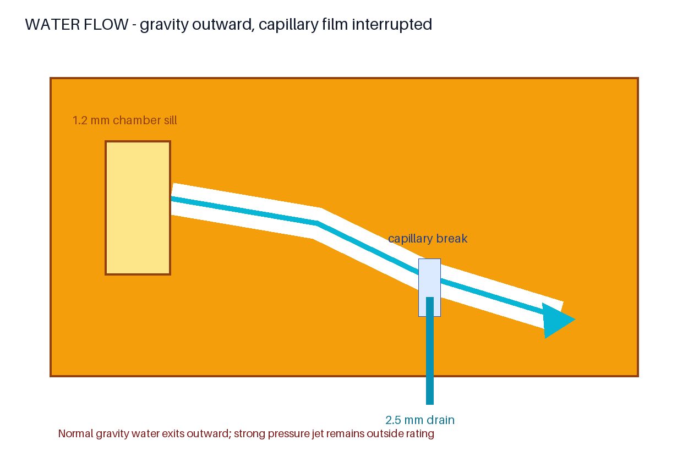

# WATER FLOW RATIONALE

## Gravity direction

Each end mirrors the same elevation strategy:

```text
connector chamber HIGH
        ↓
1.2 mm water sill beside cable route
        ↓
7° lower floor / 4° upper ceiling, both outward
        ↓
open capillary break
        ↓
Ø2.5 mm low-point drain
        ↓
outside LOW
```

The 10 mm lower run drops 1.2278 mm. The 10 mm upper ceiling drops 0.6993 mm. The computed chamber-side floor is Z=2.0500 mm and the drain capture floor is Z=0.0713 mm, for a 1.9787 mm chamber-to-drain descent.

## Chamber sill

The 1.2 mm sill flanks the cable route. It interrupts chamber-directed surface flow without lifting, pinching, or closing the 4.4 mm side-load path.

## Capillary break

The transverse groove is 1.2 mm wide and 0.8 mm deep, above the 0.5 mm prohibited micro-feature threshold. It intersects the drain and remains open, so its bottom cannot form a closed water pocket. It reduces continuous-film migration but does not constitute a pressurized seal.

## Drain and visibility

The two Ø2.5 mm drains are captured at the lowest labyrinth regions. The upper shell can be removed for visual inspection and cleaning of the channel, break, and drain region. Drain cleanliness is an operational requirement.

## Line-of-sight and rating

The retained dogleg/drip vestibule provides no straight external line of sight to the connector chamber in CAD. This multi-stage path is for gravity rain and splash. It is not a pressure-rated seal; high-pressure hose use, pressure washing, forced continuous port jets, and immersion remain outside scope.



