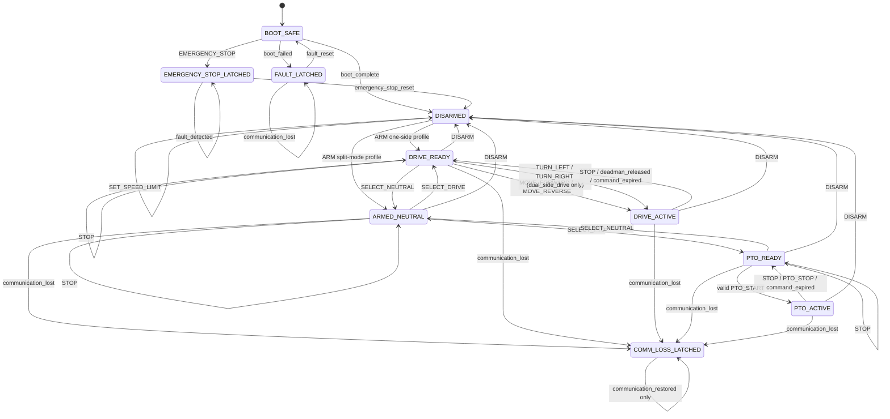

# Paddy Swarm Rover Control Safety State Machine

本書は実装コードではなく、実装言語に依存しない規範的な安全状態機械仕様です。上位参照文書は [`software/rover_control/README.md`](../README.md)、[`software/rover_control/safety/SAFETY_REQUIREMENTS.md`](SAFETY_REQUIREMENTS.md)、[`docs/safety.md`](../../../docs/safety.md) です。矛盾する場合は、より安全側の解釈を採用します。

## 1. 文書の目的

- 101件の安全要件を状態と遷移へ落とし込む。
- PWA、仮想ローバー、ESP32で同じ状態名と意味を共有する。
- ESP32側の最新状態を正本とし、UI内部状態だけで実機状態を決定しない。
- 実田んぼでの安全を保証せず、実装方式や通信データ形式を確定しない。

## 2. 状態機械の基本原則

- 未知、矛盾、欠落、例外時は出力ゼロ側へ遷移する。
- 走行出力を許可する状態は `DRIVE_ACTIVE`、PTO出力を許可する状態は `PTO_ACTIVE` だけとする。
- それ以外の全状態では走行出力とPTO出力をゼロにする。
- 再接続、再読込み、再起動だけでは再始動しない。
- 状態遷移中は出力ゼロを基本とし、未定義イベントは標準拒否する。

## 3. 状態と出力の不変条件

| State | Drive output | PTO output | Armed | Latched |
| --- | ---: | ---: | ---: | ---: |
| `BOOT_SAFE` | 0 | 0 | false | false |
| `DISARMED` | 0 | 0 | false | false |
| `ARMED_NEUTRAL` | 0 | 0 | true | false |
| `DRIVE_READY` | 0 | 0 | true | false |
| `DRIVE_ACTIVE` | guarded | 0 | true | false |
| `PTO_READY` | 0 | 0 | true | false |
| `PTO_ACTIVE` | 0 | guarded | true | false |
| `COMM_LOSS_LATCHED` | 0 | 0 | false | true |
| `FAULT_LATCHED` | 0 | 0 | false | true |
| `EMERGENCY_STOP_LATCHED` | 0 | 0 | false | true |

`guarded` は無条件出力ではありません。有効な命令、期限、session、sequence、設定、速度上限、デッドマン等の全guard成立時だけ出力可能です。

## 4. 概念上の状態変数

- `current_state`
- `current_session`
- `last_accepted_sequence`
- `command_expiry_valid`
- `communication_valid`
- `speed_limit_valid`
- `configuration_valid`
- `deadman_valid`
- `selected_direction`
- `physical_estop_asserted`
- `software_estop_latched`
- `fault_latched`
- `pto_enabled`
- `drive_profile`
- `last_stop_reason`

これらは概念であり、クラス、構造体、保存方式は確定しません。

## 5. イベント優先順位

1. 物理非常停止
2. ソフトウェア `EMERGENCY_STOP`
3. 致命的または安全上無視できないfault
4. 通信断またはwatchdog期限切れ
5. `DISARM`
6. `STOP`またはデッドマン解除
7. モード選択
8. 走行またはPTO動作命令
9. 表示、ログ、通常テレメトリー処理

下位イベントは上位イベントを打ち消しません。複数異常時は最優先状態へ遷移し、他の理由もログ用に保持します。

## 6. BOOT_SAFE

電源投入、ESP32再起動、watchdog再起動、ソフトウェア初期化開始時の状態です。PWM=0、PTO=0、armed=falseを不変条件とし、過去のARM、MOVE、PTO状態を復元しません。

設定検証、非常停止入力確認、出力初期化、必要な自己診断がすべて成功した場合だけ `DISARMED` へ遷移します。不正設定、初期化失敗、不明な起動状態では `FAULT_LATCHED`、物理非常停止中は `EMERGENCY_STOP_LATCHED` を優先します。

## 7. DISARMED

通常の安全待機状態です。走行/PTO出力はゼロで、MOVE、TURN、PTO_STARTを拒否します。接続だけではARMしません。安全な設定確認は許可できます。

明示的ARM要求と全guard成立時、初期片側駆動プロファイルでは `DRIVE_READY`、将来のDRIVE/PTO分離プロファイルでは `ARMED_NEUTRAL` へ遷移します。

## 8. ARMED_NEUTRAL

ARM済みだが動作モード未選択の状態です。全出力はゼロです。`SELECT_DRIVE` で `DRIVE_READY`、`SELECT_PTO` で `PTO_READY`、`DISARM` で `DISARMED` へ遷移します。`STOP` は出力ゼロを再確認する安全な冪等処理とし、状態は `ARMED_NEUTRAL` のままです。MOVE、TURN、PTO_STARTは拒否します。初期片側試験では通常使用しない場合があります。

## 9. DRIVE_READY

ARM済み、DRIVE選択済み、走行出力ゼロで、新しい有効なデッドマン走行命令を待つ状態です。過去のMOVEでは走行しません。PTO_STARTと直接のSELECT_PTOを拒否します。

現在session、最新sequence、期限、速度上限、設定、deadman、非常停止・fault・通信状態の全guard成立時だけ `DRIVE_ACTIVE` へ遷移します。`SELECT_NEUTRAL` は `ARMED_NEUTRAL`、`DISARM` は `DISARMED` へ遷移します。`STOP` は出力ゼロを再確認し、状態を `DRIVE_READY` のまま維持します。

## 10. DRIVE_ACTIVE

走行出力を許可できる唯一の状態です。PTO出力は常にゼロです。命令期限とデッドマン更新を継続監視し、期限超過後に出力を維持しません。

- 指を離す、デッドマン解除、通常MOVE期限切れ、`STOP` → 出力ゼロ後 `DRIVE_READY`
- `DISARM` → 出力ゼロ後 `DISARMED`
- 通信断/watchdog → 出力ゼロ後 `COMM_LOSS_LATCHED`
- fault → 出力ゼロ後 `FAULT_LATCHED`
- EMERGENCY_STOP → 出力ゼロ後 `EMERGENCY_STOP_LATCHED`

前進と後進を直接反転せず、まず出力ゼロで `DRIVE_READY` へ戻り、反転guard成立後の新規命令を必要とします。初期片側プロファイルではTURN_LEFT/TURN_RIGHTを拒否します。

## 11. PTO_READY

ARM済み、PTO選択済み、全出力ゼロでPTO_STARTを待つ状態です。走行命令を拒否します。PTO無効設定または初期片側モーター試験では到達不能です。有効なPTO_STARTと全guard成立時だけ `PTO_ACTIVE` へ遷移します。`STOP` は出力ゼロを再確認して `PTO_READY` を維持し、`SELECT_NEUTRAL` は `ARMED_NEUTRAL`、`DISARM` は `DISARMED` へ遷移します。

## 12. PTO_ACTIVE

PTO出力を許可できる唯一の状態で、走行出力は常にゼロです。MOVE、TURN、SELECT_DRIVEを拒否します。PTO_STOPまたは通常STOPで `PTO_READY`、DISARMで `DISARMED`、通信断で `COMM_LOSS_LATCHED`、faultで `FAULT_LATCHED`、非常停止で `EMERGENCY_STOP_LATCHED` へ、出力ゼロ後に遷移します。

初期片側モーター試験ではPTO機能全体を無効とします。

## 13. COMM_LOSS_LATCHED

有効な制御更新のwatchdog期限切れ、armed中のsession切断、通信処理停止、接続状態の矛盾等で入ります。全出力ゼロ、armed=falseとし、MOVE、PTO_START、ARMを拒否します。

`communication_restored` や古いheartbeatだけでは解除せず、状態は `COMM_LOSS_LATCHED` のままです。ARM、MOVE、PTO_STARTを引き続き拒否します。新しい有効なsession、出力ゼロ確認、通信正常、明示的な安全確認が完了した場合だけ、別途 `DISARMED` へ解除可能とします。その解除イベント名は追加せず未確定事項として残し、解除後は再ARMを必要とします。

## 14. FAULT_LATCHED

設定不正、不明状態、内部例外、出力制御矛盾、重大なセンサー/encoder矛盾、不可能な遷移等で入ります。全出力ゼロ、armed=falseとし、ARM、MOVE、PTO_STARTを拒否します。ログ失敗より出力停止を優先します。

原因解消と人間による確認後、`fault_reset` で `BOOT_SAFE` へ遷移し、起動時検査をやり直します。ACTIVEまたはREADY状態へ直接戻りません。reset方式の詳細は未確定です。

## 15. EMERGENCY_STOP_LATCHED

物理非常停止またはソフトウェアEMERGENCY_STOPで入る最優先状態です。全出力ゼロ、armed=falseとし、ARM、MOVE、PTO_STARTを拒否します。通信再接続、アプリ/ESP32再起動だけでは危険な自動復帰を行いません。

UI表示やボタンの見た目だけでは非常停止を解除しません。ESP32が人間による明示的なソフトウェア非常停止解除操作または解除要求を有効な`emergency_stop_reset`として受理し、物理入力解放、出力ゼロ、faultなし、通信正常、人間による明示的安全確認の全guard成立を検証した後だけ、`DISARMED` へ遷移します。faultが残る場合は`DISARMED`へ遷移せず、非常停止ラッチを維持するか、非常停止解除成立後に`FAULT_LATCHED`へ移ります。いずれの場合も全出力ゼロを維持し、ARMや動作を復元しません。非常停止中にESP32自体が再起動した場合は、解除イベントとは別に起動イベントとして `BOOT_SAFE` から開始します。物理非常停止はソフトウェアから独立します。

## 16. 正常遷移表

| Current state | Event | Guard | Action | Next state |
| --- | --- | --- | --- | --- |
| `BOOT_SAFE` | `boot_complete` | 起動検査PASS | 全出力ゼロを確認 | `DISARMED` |
| `BOOT_SAFE` | `boot_failed` | 起動検査失敗 | 全出力ゼロ、faultをラッチ | `FAULT_LATCHED` |
| `DISARMED` | `SET_SPEED_LIMIT` | 値が有効範囲内 | 上限値を受理、出力なし | `DISARMED` |
| `DISARMED` | `ARM` | `one_side_test`かつ全guard成立 | 全出力ゼロ | `DRIVE_READY` |
| `DISARMED` | `ARM` | 将来の分離モードかつ全guard成立 | 全出力ゼロ | `ARMED_NEUTRAL` |
| `ARMED_NEUTRAL` | `SELECT_DRIVE` | DRIVE有効 | 全出力ゼロ | `DRIVE_READY` |
| `ARMED_NEUTRAL` | `SELECT_PTO` | PTO有効 | 全出力ゼロ | `PTO_READY` |
| `DRIVE_READY` | `SELECT_NEUTRAL` | 常時 | 全出力ゼロ | `ARMED_NEUTRAL` |
| `PTO_READY` | `SELECT_NEUTRAL` | 常時 | 全出力ゼロ | `ARMED_NEUTRAL` |
| `DRIVE_READY` | `MOVE_FORWARD` | 全guard成立 | guarded drive forward | `DRIVE_ACTIVE` |
| `DRIVE_READY` | `MOVE_REVERSE` | 全guard成立 | guarded drive reverse | `DRIVE_ACTIVE` |
| `DRIVE_READY` | `TURN_LEFT` | `dual_side_drive`かつ全guard成立 | guarded turn | `DRIVE_ACTIVE` |
| `DRIVE_READY` | `TURN_RIGHT` | `dual_side_drive`かつ全guard成立 | guarded turn | `DRIVE_ACTIVE` |
| `ARMED_NEUTRAL` | `STOP` | 常時 | 全出力ゼロを再確認 | `ARMED_NEUTRAL` |
| `DRIVE_READY` | `STOP` | 常時 | 全出力ゼロを再確認 | `DRIVE_READY` |
| `DRIVE_ACTIVE` | `STOP` | 常時 | drive=0 | `DRIVE_READY` |
| `PTO_READY` | `STOP` | 常時 | 全出力ゼロを再確認 | `PTO_READY` |
| `PTO_ACTIVE` | `STOP` | 常時 | PTO=0 | `PTO_READY` |
| `DRIVE_ACTIVE` | `deadman_released` | 常時 | drive=0 | `DRIVE_READY` |
| `DRIVE_ACTIVE` | `command_expired` | 常時 | drive=0 | `DRIVE_READY` |
| `PTO_ACTIVE` | `command_expired` | 常時 | PTO=0 | `PTO_READY` |
| `PTO_READY` | `PTO_START` | 全guard成立 | guarded PTO | `PTO_ACTIVE` |
| `PTO_ACTIVE` | `PTO_STOP` | 常時 | PTO=0 | `PTO_READY` |
| `ARMED_NEUTRAL` | `DISARM` | 常時 | 全出力ゼロ、armed=false | `DISARMED` |
| `DRIVE_READY` | `DISARM` | 常時 | 全出力ゼロ、armed=false | `DISARMED` |
| `DRIVE_ACTIVE` | `DISARM` | 常時 | 全出力ゼロ、armed=false | `DISARMED` |
| `PTO_READY` | `DISARM` | 常時 | 全出力ゼロ、armed=false | `DISARMED` |
| `PTO_ACTIVE` | `DISARM` | 常時 | 全出力ゼロ、armed=false | `DISARMED` |
| `COMM_LOSS_LATCHED` | `communication_restored` | 復旧通知のみ | 全出力ゼロ、ラッチ維持 | `COMM_LOSS_LATCHED` |
| `FAULT_LATCHED` | `fault_reset` | 原因解消と明示確認済み | 全出力ゼロ | `BOOT_SAFE` |
| `EMERGENCY_STOP_LATCHED` | `emergency_stop_reset` | 全解除guard成立 | 全出力ゼロ、armed=false | `DISARMED` |

## 17. 異常遷移表

| Current state | Event | Guard | Action | Next state |
| --- | --- | --- | --- | --- |
| 任意状態 | `EMERGENCY_STOP` | 常時 | 全出力ゼロ、armed=false、非常停止ラッチ | `EMERGENCY_STOP_LATCHED` |
| `ARMED_NEUTRAL` | `communication_lost` | 常時 | 全出力ゼロ、armed=false、通信断ラッチ | `COMM_LOSS_LATCHED` |
| `DRIVE_READY` | `communication_lost` | 常時 | 全出力ゼロ、armed=false、通信断ラッチ | `COMM_LOSS_LATCHED` |
| `DRIVE_ACTIVE` | `communication_lost` | 常時 | 全出力ゼロ、armed=false、通信断ラッチ | `COMM_LOSS_LATCHED` |
| `PTO_READY` | `communication_lost` | 常時 | 全出力ゼロ、armed=false、通信断ラッチ | `COMM_LOSS_LATCHED` |
| `PTO_ACTIVE` | `communication_lost` | 常時 | 全出力ゼロ、armed=false、通信断ラッチ | `COMM_LOSS_LATCHED` |
| 非常停止ラッチ以外の状態 | `fault_detected` | 物理またはソフトウェア非常停止が成立していない | 全出力ゼロ、armed=false、faultラッチ、fault理由を記録 | `FAULT_LATCHED` |
| `EMERGENCY_STOP_LATCHED` | `fault_detected` | 常時 | 全出力ゼロと非常停止ラッチを維持し、fault理由も追加保持 | `EMERGENCY_STOP_LATCHED` |
| `FAULT_LATCHED` | `communication_lost` | 常時 | 全出力ゼロとfaultラッチを維持し、通信断理由も追加保持 | `FAULT_LATCHED` |

非常停止とfaultが同時または重複して成立した場合は、イベント優先順位により `EMERGENCY_STOP_LATCHED` を表示上の最優先状態とし、fault理由も失わず保持します。非常停止中のfaultで`FAULT_LATCHED`へ降格しません。faultが残る間の`emergency_stop_reset`では`DISARMED`へ遷移しません。`FAULT_LATCHED`中の通信断はfault状態を維持し、通信断理由も保持します。`DISARMED`での通信断は出力ゼロを維持し、自動ARMや自動始動を発生させません。

## 18. 標準拒否規則

- 未定義イベント、未知command、別session、重複/古いsequence、期限切れ、必須項目欠落を拒否する。
- 拒否で状態や出力を危険側へ変更しない。
- DISARMED/READYで許可されない動作命令、ACTIVE中の相反モード命令を拒否する。
- latched状態では解除手順以外を拒否し、拒否理由を記録対象とする。
- 拒否された命令を後から再実行しない。

## 19. STOPとEMERGENCY_STOPの比較

| Item | STOP | EMERGENCY_STOP |
| --- | --- | --- |
| Purpose | 通常の安全停止 | より高優先度の非常停止 |
| Output | 対象出力をゼロ | 全出力を直ちにゼロ |
| Latch | 通常は非ラッチ | 必ずラッチ |
| Armed | 状態定義に従う | false |
| Recovery | 新規デッドマン命令等 | `emergency_stop_reset`で`DISARMED`、その後も再ARM必須 |
| Reconnect/reload | 自動再始動不可 | 解除不可、自動再始動不可 |

## 20. 初期片側駆動試験プロファイル

- モーター1基、MD10C 1枚、低速度上限で行う。
- `DISARMED` からARM成功後は `DRIVE_READY` へ遷移できる。
- PTO機能、TURN_LEFT、TURN_RIGHT、左右差補正を無効または拒否する。
- 車体を浮かせるか駆動部を地面から離し、物理非常停止へ即時アクセス可能にする。
- 水、泥、実田んぼから離れた乾いた環境で行う。

## 21. 将来の左右駆動プロファイル

- 左右出力、方向設定、速度制限、encoder監視を独立して扱える設計とする。
- `ARMED_NEUTRAL`、`DRIVE_READY`、`DRIVE_ACTIVE`を引き続き使用する。
- 片側故障時の自動継続走行は未確定で、安全側停止を初期方針とする。
- 左右差補正アルゴリズムとTURN許可条件は本書では確定しない。

## 22. UI表示との関係

- UIはESP32の最新かつ有効なテレメトリー状態を表示する。
- アプリ再読込み直後は `UNKNOWN / 操作不能` とし、最新状態受信前にDISARM等を推測表示しない。
- UIボタン状態はESP32状態に従い、不一致時は操作を禁止する。
- `COMM_LOSS_LATCHED`、`FAULT_LATCHED`、`EMERGENCY_STOP_LATCHED`を区別して表示する。
- 非常停止解除表示だけで再始動可能と表示しない。

`UNKNOWN` はUI表示用であり、ESP32の正式な安全状態には追加しません。

## 23. 状態遷移図

この図は補助表示です。規範的な遷移は表と本文を正本とします。全状態からfault/非常停止へ遷移できるという優先規則は、可読性のため矢印を省略しています。

## 24. 状態機械の不変条件一覧

- ACTIVE以外では該当出力ゼロ。
- DRIVEとPTOを同時出力しない。
- DISARMEDおよびlatched状態でARMなしに出力しない。
- 再接続・再読込み・再起動で自動始動しない。
- 古い、重複、期限切れ命令で遷移しない。
- 不明状態で出力しない。
- direction反転前に出力ゼロを経由する。
- 通信断、非常停止解除、fault解除後は再ARMを必要とする。
- 初期片側試験でPTOとTURNを許可しない。

## 25. 文書ベース検証シナリオ

| # | Given / When | Expected output | Expected state |
| ---: | --- | --- | --- |
| 1 | BOOT_SAFE / `boot_complete` | all=0 | DISARMED |
| 2 | BOOT_SAFE / `boot_failed` | all=0 | FAULT_LATCHED |
| 3 | DISARMED / 正常な`SET_SPEED_LIMIT` | all=0 | DISARMED |
| 4 | DISARMED / 不正な`SET_SPEED_LIMIT` | all=0 | DISARMED、拒否 |
| 5 | DISARMED / 有効`ARM` | all=0 | DRIVE_READYまたはARMED_NEUTRAL |
| 6 | DRIVE_READY / `SELECT_NEUTRAL` | all=0 | ARMED_NEUTRAL |
| 7 | PTO_READY / `SELECT_NEUTRAL` | all=0 | ARMED_NEUTRAL |
| 8 | DRIVE_READY / `MOVE_FORWARD` | guarded drive | DRIVE_ACTIVE |
| 9 | DRIVE_READY / `MOVE_REVERSE` | guarded drive | DRIVE_ACTIVE |
| 10 | one_side_test / `TURN_LEFT` | all=0 | 状態不変、拒否 |
| 11 | DRIVE_ACTIVE / `STOP` | drive=0 | DRIVE_READY |
| 12 | PTO_ACTIVE / `STOP` | PTO=0 | PTO_READY |
| 13 | DRIVE_ACTIVE / `deadman_released` | drive=0 | DRIVE_READY |
| 14 | DRIVE_ACTIVE / `command_expired` | drive=0 | DRIVE_READY |
| 15 | PTO_ACTIVE / `command_expired` | PTO=0 | PTO_READY |
| 16 | DRIVE_ACTIVE / `communication_lost` | all=0 | COMM_LOSS_LATCHED |
| 17 | COMM_LOSS_LATCHED / `communication_restored`のみ | all=0 | COMM_LOSS_LATCHED |
| 18 | EMERGENCY_STOP_LATCHED以外 / 物理・ソフトウェア非常停止非成立中の`fault_detected` | all=0、fault理由を記録・保持 | FAULT_LATCHED |
| 19 | FAULT_LATCHED / `fault_reset` | all=0 | BOOT_SAFE |
| 20 | any / `EMERGENCY_STOP` | all=0 | EMERGENCY_STOP_LATCHED |
| 21 | EMERGENCY_STOP_LATCHED / 物理非常停止解放、明示的解除要求、faultなし、通信正常、全出力ゼロ、人間の安全確認を満たした`emergency_stop_reset` | all=0、armed=false | DISARMED |
| 22 | emergency_stop_reset後 / ARMなし | all=0 | DISARMED |
| 23 | READY / 別session命令 | all=0 | 状態不変、拒否 |
| 24 | READY / 重複命令 | all=0 | 状態不変、拒否 |
| 25 | READY / 期限切れ命令 | all=0 | 状態不変、拒否 |
| 26 | ARMED_NEUTRAL / `communication_lost` | all=0 | COMM_LOSS_LATCHED |
| 27 | DRIVE_READY / `communication_lost` | all=0 | COMM_LOSS_LATCHED |
| 28 | PTO_READY / `communication_lost` | all=0 | COMM_LOSS_LATCHED |
| 29 | EMERGENCY_STOP_LATCHED / `fault_detected` | all=0、fault理由保持 | EMERGENCY_STOP_LATCHED |
| 30 | EMERGENCY_STOP_LATCHED / fault残存中の`emergency_stop_reset` | all=0、ARM禁止 | DISARMEDへ遷移しない |
| 31 | FAULT_LATCHED / `communication_lost` | all=0、通信断理由保持 | FAULT_LATCHED |
| 32 | UIの解除表示だけが変化 | all=0、解除不成立 | EMERGENCY_STOP_LATCHED |

## 26. 未確定事項

- watchdog最終時間、方向反転待機時間、fault分類
- fault reset方式、emergency stop resetのprotocol名
- 通信方式、メッセージ形式、encoder異常閾値
- 左右差補正、PTOデッドマン方式、状態数値コード、状態永続化方式
- RTOSタスク構成

未確定であることを理由に、本書の安全側不変条件を弱めません。

## 27. 次の承認対象

次の1作業候補は `software/rover_control/protocol/README.md` で、状態機械を運ぶ共通通信契約の境界を定義することです。schemaやコードはまだ作成しません。本作業ではこのファイルを作成しません。

### 安全要件トレーサビリティ

| Safety requirement category | State-machine section |
| --- | --- |
| BOOT | 3, 6, 16, 24 |
| ARM | 3, 7–9, 16, 24 |
| DEADMAN | 9, 10, 16, 25 |
| COMM | 5, 13, 17, 24 |
| CMD | 4, 9, 18, 25 |
| DRIVE | 3, 9, 10, 20, 21 |
| STOP | 10, 12, 16, 19 |
| ESTOP | 5, 15, 17, 19 |
| MODE | 8, 11, 12, 16 |
| APP | 22, 25 |
| TEL | 4, 22 |
| LOG | 5, 13–15, 18 |
| CONFIG | 6, 9, 11, 26 |
| SIM | 1, 23, 25 |
| HWGATE | 20, 24, 25 |
| FAULT | 5, 14, 17, 24 |
| BOUNDARY | 1–3, 15, 20, 26 |
